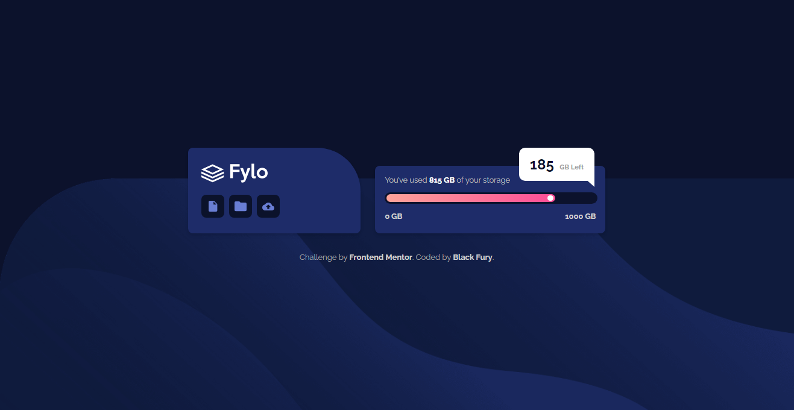

# Frontend Mentor - Fylo data storage component solution

This is a solution to the [Fylo data storage component challenge on Frontend Mentor](https://www.frontendmentor.io/solutions/fylo-data-storage-component-solution-l1rVgtcJ5A). Frontend Mentor challenges help us to improve our coding skills by building realistic projects.   

## Built with

- Semantic HTML5 markup
- CSS custom properties
- SCSS
- Flexbox
- Mobile-first workflow

Preview it here - [Fylo data storage component solution](https://id-dev3.github.io/Fylo-data-storage-component-master/)   

## Author

- Website - [Idris](https://id-dev3.github.io/)
- Frontend Mentor - [@BlackFury117](https://www.frontendmentor.io/profile/BlackFury117)
- Twitter - [@id_dev3](https://www.twitter.com/id-dev3)